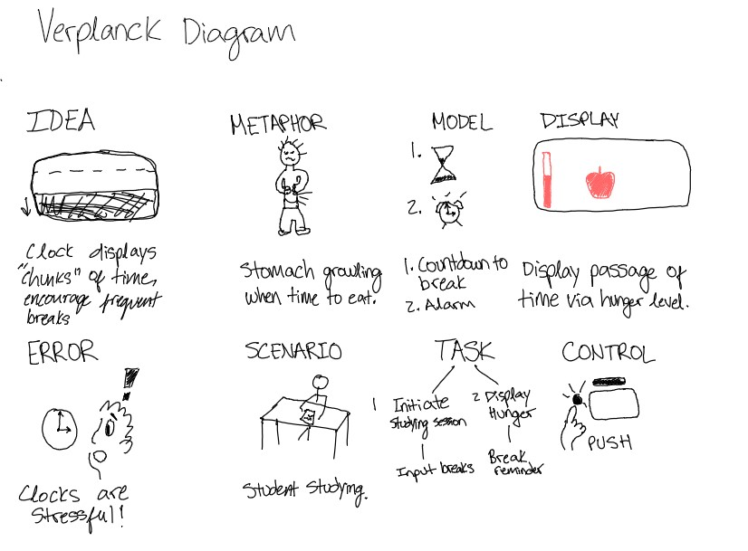
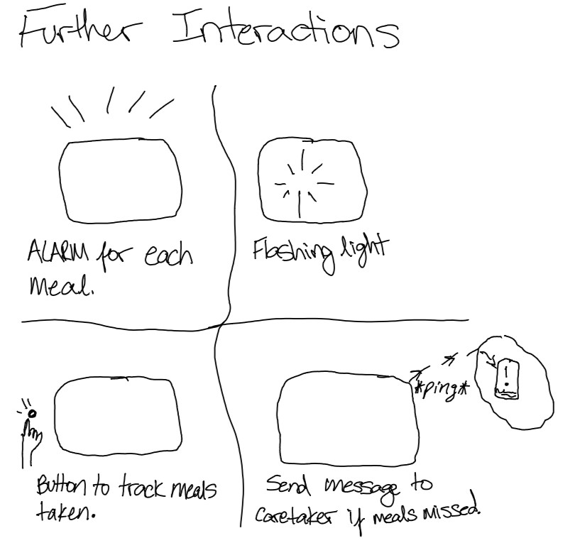

# Interactive Prototyping: The Clock of Pi
**NAMES OF COLLABORATORS HERE**

**Please indicate anyone you collaborated with on this Lab here.** 

Sam Willenson and Grace Nho helped me with part D of the lab and with setting up Virtual Source Code. Additionally, they gave me feedback when ideating potential projects.

### Modify the barebones clock to make it your own

The concept of this device is to use a measure time as the time elapsed between breaks. The display shows a bar displaying a countdown of the maximum time allowed for working. As the bar goes down from full, pictures of different food items will be displayed at various intervals. The first interval will display an apple (as seen in the diagram above.) This indicates that the user may take a "snack-size" break at that time. If the user forgoes the break and continues working, they will reach the second interval where a sandwich will be displayed. This indicates that user may take a "small-meal". If the user decides to keep working, they will reach the third interval where a roasted turkey will be displayed. The bar will also be empty at this point. This signals to the user that they must take a "meal" break before continuing their work.

One button will be used to initiate a work session. Another button is used to start and end breaks. If a break is taken before the bar is empty, the user pushes the button and the bar goes back to full.

[Copy of Code](https://github.com/jaxriemer/Interactive-Lab-Hub/blob/96c9f862c1d08e4791d3aa452051d89cb06a94ee/Lab%202/screen_prototype.py)

## Part F. 
## Make a short video of your modified barebones PiClock

I made some modifications to the interaction in my Verplanck Diagram to stage the interaction in the video above. The clock shows the passage of time through different mealtimes. The idea is that our bodies, themselves, are machines that have a biological clock. By using the mealtimes as a form of time-keeping, the user is also more in-tune with their hunger.

## Part G. 
## Sketch and brainstorm further interactions and features you would like for your clock for Part 2.

Feedback: 

# Lab 2 Part 2

For this iteration of my design, I decided to integrate a countdown feature that is displayed by a bar. The countdown is initiated by a "start" button. As time passes, the bar level will decrease. Once the bar is empty, a message is displayed to the user "Take a Break!". The user may also decide to take a break at any point by pressing the "break" button. When the user returns from their break, they can press the "start" button and the countdown will restart with the bar full.
## Prototyped Interaction

