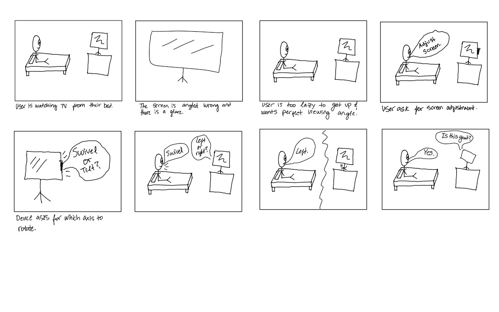
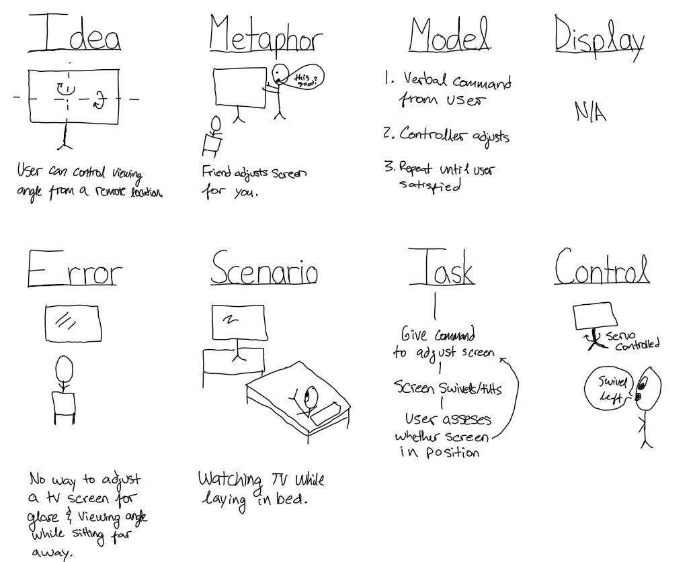
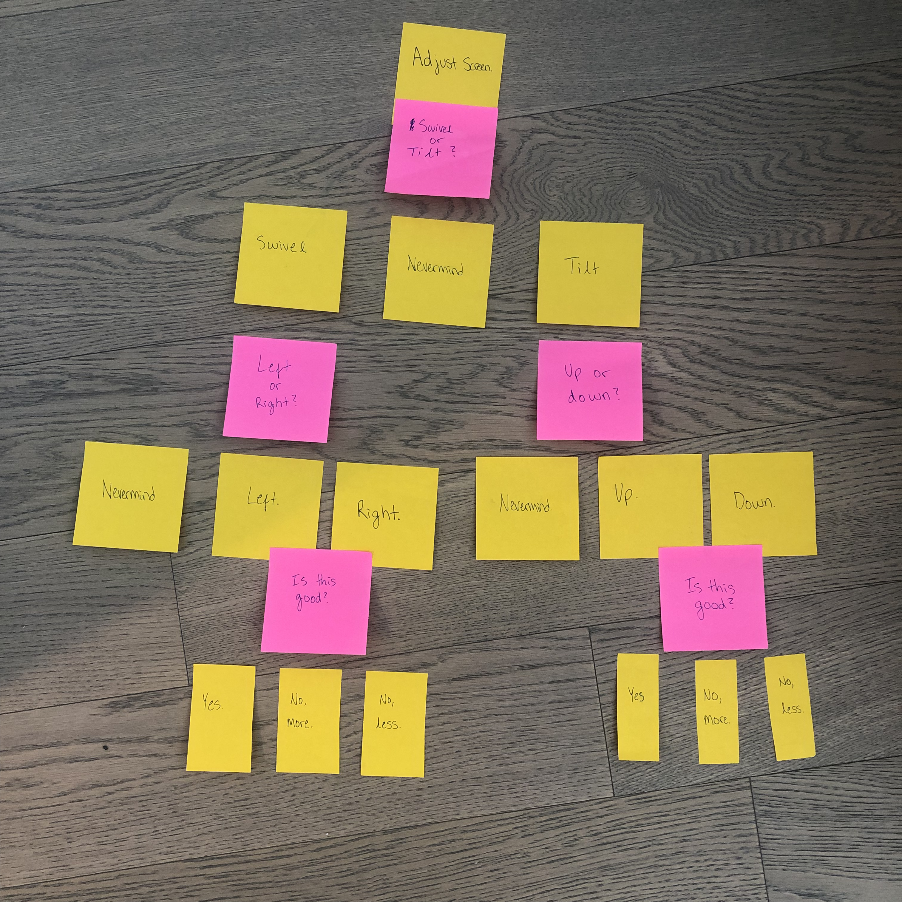
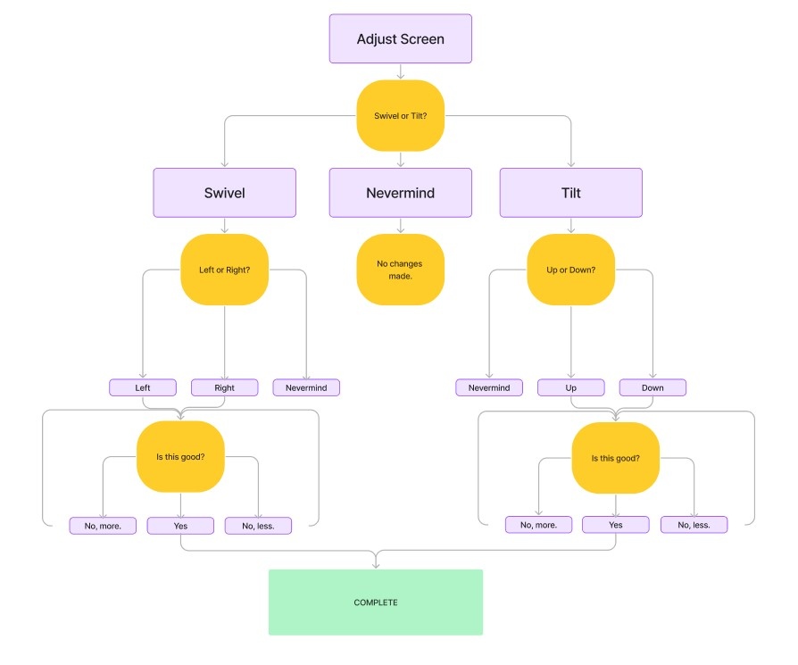
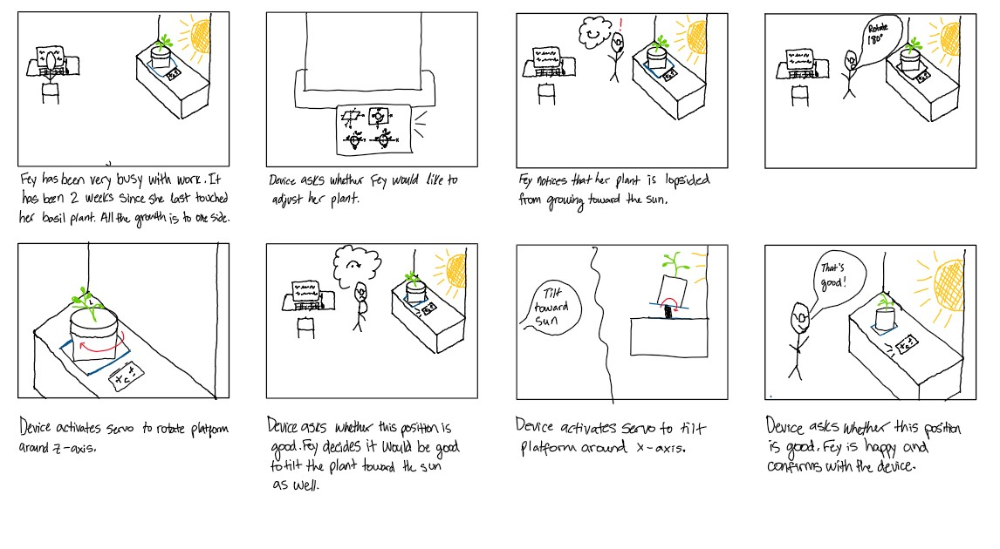
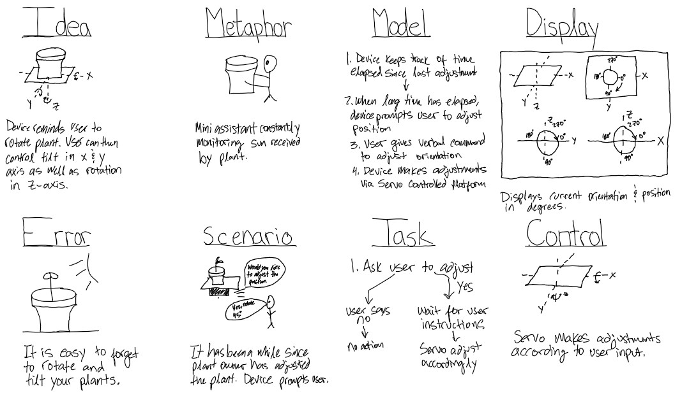

# Chatterboxes

\*\***Write your own shell file to use your favorite of these TTS engines to have your Pi greet you by name.**\*\*

[Copy of Greeting Code](https://github.com/jaxriemer/Interactive-Lab-Hub/blob/ead7e63efcec7a87054451f91adcf42d267afe03/Lab%203/name_demo.sh)

\*\***Write your own shell file that verbally asks for a numerical based input (such as a phone number, zipcode, number of pets, etc) and records the answer the respondent provides.**\*\*

[Copy of Info Prompt Code](https://github.com/jaxriemer/Interactive-Lab-Hub/blob/733f5fa33417b18b12e3b5e159a439a9e4ea6e6f/Lab%203/info_prompt.sh)

### Storyboard

Storyboard and/or use a Verplank diagram to design a speech-enabled device. (Stuck? Make a device that talks for dogs. If that is too stupid, find an application that is better than that.) 

\*\***Post your storyboard and diagram here.**\*\*

Write out what you imagine the dialogue to be. Use cards, post-its, or whatever method helps you develop alternatives or group responses. 

\*\***Please describe and document your process.**\*\*

First I tried mapping out the potential responses using post-it notes. This allowed me to move responses around as needed. I then made a higher-fidelity flowchart to help me understand all the possible answers.

### Acting out the dialogue

Find a partner, and *without sharing the script with your partner* try out the dialogue you've designed, where you (as the device designer) act as the device you are designing.  Please record this interaction (for example, using Zoom's record feature).

\*\***Describe if the dialogue seemed different than what you imagined when it was acted out, and how.**\*\*

From acting out the dialogue I learned that people may use different words for the same thing. For example, a user may request the screen to "tilt forward" or "move down". It is important that I include all possible keywords in my test_words.py file.

Feedback: Sam Willenson provided feedback on my design. He recommended that I add degreees to define the position of the screen. One thing that also became apparent from the dialogue is that I should ask whether the user wants to make an adjustment in a different axis at the end of the intitial adjustment.

### Wizarding with the Pi (optional)
In the [demo directory](./demo), you will find an example Wizard of Oz project. In that project, you can see how audio and sensor data is streamed from the Pi to a wizard controller that runs in the browser.  You may use this demo code as a template. By running the `app.py` script, you can see how audio and sensor data (Adafruit MPU-6050 6-DoF Accel and Gyro Sensor) is streamed from the Pi to a wizard controller that runs in the browser `http://<YouPiIPAddress>:5000`. You can control what the system says from the controller as well!

\*\***Describe if the dialogue seemed different than what you imagined, or when acted out, when it was wizarded, and how.**\*\*

# Lab 3 Part 2

For Part 2, you will redesign the interaction with the speech-enabled device using the data collected, as well as feedback from part 1.

## Prep for Part 2

1. What are concrete things that could use improvement in the design of your device? For example: wording, timing, anticipation of misunderstandings...

There should be greater flexibility in the input provided by the user. There are different ways that a user may describe orientation and position. It is important to take this into account. Additionally, it would be helpful to display this information to the user in real-time. Also providing a unit of measurements (angle degrees for example) would allow for clearer communication between the robot and user, and increased precision of positioning.

2. What are other modes of interaction _beyond speech_ that you might also use to clarify how to interact?

A proximity sensor could be added to detect when the user is in front of the device. This would ensure the user is present for the interaction.

3. Make a new storyboard, diagram and/or script based on these reflections.

Storyboard:

Verplank Diagram:

## Prototype your system

The system should:
* use the Raspberry Pi 
* use one or more sensors
* require participants to speak to it. 

*Document how the system works*

*Include videos or screencaptures of both the system and the controller.*

## Test the system
Try to get at least two people to interact with your system. (Ideally, you would inform them that there is a wizard _after_ the interaction, but we recognize that can be hard.)

Answer the following:

### What worked well about the system and what didn't?
\*\**your answer here*\*\*

### What worked well about the controller and what didn't?

\*\**your answer here*\*\*

### What lessons can you take away from the WoZ interactions for designing a more autonomous version of the system?

\*\**your answer here*\*\*

### How could you use your system to create a dataset of interaction? What other sensing modalities would make sense to capture?

\*\**your answer here*\*\*

